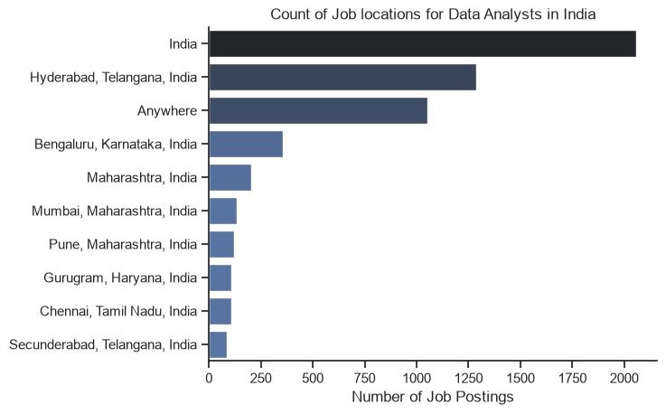
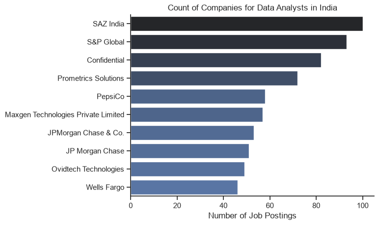
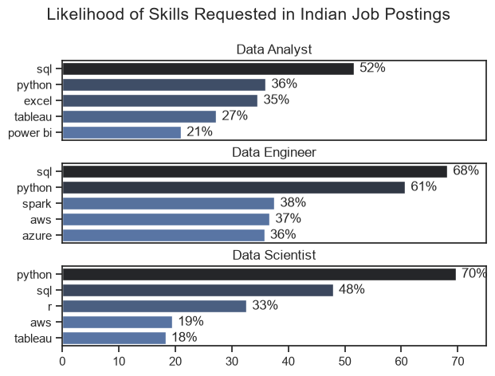

# Indian Job Market Ananlysis With Python 

An end-to-end exploratory data analysis project examining Indian data job trends, salaries, in-demand skills, and technology requirements using Python.

## Overview 

This is my analysis of the Indian data job market, with a focus on opportunities in Data Engineering, Data Analytics, and related technology roles. This project was developed to better understand the skills, technologies, and salary trends shaping India's rapidly evolving data industry. The objective is to identify the most valuable technical skills and gain insights that can guide students and aspiring professionals toward informed career decisions.

The analysis is based on a comprehensive dataset of job postings used in Luke Barousse's Python course. The dataset includes information such as job titles, salary estimates, locations, and required technical skills. Using Python for data cleaning, exploration, and visualization, this project investigates key questions surrounding skill demand, salary distribution, technology trends, and the relationship between compensation and in-demand skills within the Indian job market.

## The Questions 

This project explores the Indian data job market by answering the following key questions:

1. **Where are Data Analyst opportunities concentrated across India, which companies hire the most Data Analysts, and what common job benefits and perks do they offer?**

2. **Which technical skills are most in demand across the three most common data-related roles?**

3. **What are the current trends in the demand for Data Analyst skills?**

4. **How do salaries vary for Data Analysts based on different technical skills and job requirements?**

5. **Which skills provide the best balance of high demand and high salary, making them the most valuable for aspiring Data Analysts to learn?**

## Tools Used

This project was built using a combination of Python libraries and development tools to clean, analyze, visualize, and manage the data efficiently.

- **Python** – The core programming language used for data cleaning, exploratory data analysis (EDA), and generating insights from the Indian data job market dataset.

### Python Libraries

- **Pandas** – Used for data manipulation, preprocessing, aggregation, and analysis.
- **NumPy** – Assisted with numerical operations and efficient array computations.
- **Matplotlib** – Used to create a variety of visualizations for analyzing trends and distributions.
- **Seaborn** – Helped build aesthetically pleasing and statistically informative charts.

### Development Environment

- **Jupyter Notebook** – Served as the primary environment for performing interactive analysis, documenting observations, and presenting findings.
- **Visual Studio Code** – Used for project organization, writing reusable Python scripts, and managing the overall project structure.

### Version Control

- **Git & GitHub** – Used for version control, tracking project progress, and hosting the complete source code and documentation, ensuring reproducibility and easy collaboration.

## Data Preparation & Cleaning

Before beginning the analysis, the dataset was cleaned and transformed to ensure consistency, accuracy, and reliability. The preprocessing pipeline involved importing the required libraries, loading the dataset, converting data types, and preparing columns for analysis.

### Importing Required Libraries

The following libraries were used throughout the project for data manipulation, visualization, and processing:

```python
import ast
import numpy as np
import pandas as pd
import matplotlib.pyplot as plt
import seaborn as sns
from datasets import load_dataset
```

### Loading the Dataset

The dataset was imported using the `datasets` library and converted into a Pandas DataFrame for further analysis.

```python
dataset = load_dataset("lukebarousse/data_jobs")
df = dataset["train"].to_pandas()
```

### Data Cleaning

To make the dataset analysis-ready, the following preprocessing steps were performed:

- Converted the `job_posted_date` column to the `datetime` format.
- Transformed the `job_skills` column from string representations into Python lists using `ast.literal_eval()`.
- Handled missing values where necessary to avoid errors during analysis.

```python
df["job_posted_date"] = pd.to_datetime(df["job_posted_date"])

df["job_skills"] = df["job_skills"].apply(
    lambda x: ast.literal_eval(x) if pd.notna(x) else x
)
```

### Filtering the Dataset

Since this project focuses exclusively on the **Indian data job market**, the dataset was filtered to include only job postings located in **India**.

```python
df_india = df[df["job_country"] == "India"].copy()
```

This filtered DataFrame served as the foundation for all subsequent exploratory analysis and visualizations.

## 1. Where are Data Analyst jobs most common in India, which companies hire the most analysts, and what benefits are commonly offered?

To gain an overview of the Indian Data Analyst job market, I filtered the dataset to include only **Data Analyst** roles located in **India**.

I then explored the geographic distribution of jobs, identified the companies with the highest number of openings, and analyzed common job benefits such as work from home opportunities, degree requirements, and health insurance. This analysis provides a snapshot of the hiring landscape before exploring skills and salary trends.

For Full Code: [1.EDA](1_EDA.ipynb)


### Results

- **Top Job Locations for Data Analysts in India**




- **Most Common Job Benefits & Requirements**


- **Top Companies Hiring Data Analysts**




### Insights

- Data Analyst opportunities are concentrated in India's major technology and business hubs.
- A small number of companies contribute a significant share of the available Data Analyst openings.
- Most employers continue to prefer candidates with a formal degree, while work-from-home and health insurance benefits vary across job postings.
- These findings provide a strong foundation for understanding the Indian job market before analyzing skill demand and salary trends.

## 2. Which technical skills are most in demand across the three most common data roles?

To identify the most sought-after technical skills, I analyzed job postings for the three most common data roles in India. After extracting and counting individual skills from each posting, I calculated the percentage of jobs requiring each skill. This highlights the core technologies employers expect candidates to possess across different career paths.

For Full Code: [2. The Skill Count](2_Skill_Count.ipynb)

### Visualize Data

```python
fig, ax = plt.subplots(len(job_titles), 1)
sns.set_theme(style='ticks')

for i, job_title in enumerate(job_titles):
  df_plot = df_skills_perc[df_skills_perc['job_title_short'] == job_title].head(5)
  sns.barplot(data=df_plot, x='skill_percent', y='job_skills', ax=ax[i], hue='skill_count', palette='dark:b_r')
  ax[i].set_title(job_title)
  ax[i].set_xlabel('')
  ax[i].set_ylabel('')
  ax[i].get_legend().remove()
  ax[i].set_xlim(0,75)

  for n, v in enumerate(df_plot['skill_percent']):
    ax[i].text(v+1, n, f'{v:.0f}%', va='center')

  if i!= len(job_titles) - 1:
    ax[i].set_xticks([])

fig.suptitle("Likelihood of Skills Requested in Indian Job Postings", fontsize=15)
fig.tight_layout(h_pad=0.5)
plt.show()
```

### Results

**Likelihood of Skills Requested Across the Top 3 Data Roles in India**



### Insights

- **The Baseline Essentials:** SQL and Python are non-negotiable fundamentals across all three career paths, consistently appearing as top requirements.
- **Role-Specific Divergence:** While core programming overlaps, the specialization distinctively splits based on output:
  - **Data Analysts** see a heavy skew toward data querying, visualization, and reporting tools (e.g., Power BI/Tableau).
  - **Data Engineers** require heavy infrastructure tools focusing on databases, cloud platforms (AWS/Azure), and big data processing (Spark/Hadoop).
  - **Data Scientists** lean deeper into advanced statistical packages and predictive modeling libraries.
- **Strategic Takeaway:** Aspiring data professionals in India should prioritize SQL and Python first, then branch into specialized stacks depending on their target role rather than trying to learn everything at once.

## 3. How are in-demand skills trending for Data Analysts in India?

To understand how the market evolved throughout the year, I tracked the monthly demand for the top 5 most requested skills for Data Analysts in India. By normalizing the skill counts against the total job postings each month, this analysis reveals whether certain technologies are gaining traction or losing momentum over time.

For Full Code: [3.The Trend Analysis](3_Skills_Trend.ipynb)

### Visualize Data

```python
# Plotting top 5 skills
df_plot = df_DA_India_perc.iloc[:, :5]

sns.set_theme(style='ticks')
sns.lineplot(data=df_plot, dashes=False, palette='tab10')
sns.despine()

plt.title('Trending Top Skills for Data Analysts in India')
plt.ylabel('Likelihood in Job Postings')
plt.xlabel('Months')
plt.legend().remove()

# Formatting Y-axis as percentage
ax = plt.gca()
ax.yaxis.set_major_formatter(PercentFormatter(decimals=0))

# Adding inline labels at the end of each line
for i in range(5):
    plt.text(11.2, df_plot.iloc[-1, i], df_plot.columns[i])

plt.show()
```


### Results

**Trending Top Skills for Data Analysts in India**


### Insights

- **Consistent Market Leaders:** Core technologies like SQL and Python maintain a consistently high baseline throughout the year, cementing their status as evergreen requirements for data analyst roles in India.
- **Market Stability:** While absolute hiring volumes might shift month-to-month based on seasonal trends, the relative *likelihood* (percentage) of these top 5 skills appearing remains remarkably stable across all four quarters.
- **The Visualization Stack:** Alongside database management, business intelligence tools (like Power BI or Tableau) demonstrate a steady, non-negotiable presence, proving that data communication is just as vital as data extraction.
- **Strategic Learning Path:** Because these top skills do not experience sudden market volatility or flash-in-the-pan drops, aspiring professionals in India can confidently invest long-term effort into mastering this specific core stack.

## 4. How well do jobs and skills pay for Data Analysts in India?

To investigate the financial side of the data industry, I looked into the salary distributions across major data roles in India and dug deeper into how specific technical skills affect earning potential for Data Analysts. This analysis compares both the highest-paying niche skills against the baseline earnings of the most frequently requested skills.

For Full Code: [4.The Salary Analysis](4_Salary_Analysis.ipynb)

### Visualize Data

```python
# Plotting Skills vs Pay
fig, ax = plt.subplots(2, 1, figsize=(10, 8))
sns.set_theme(style="ticks")

sns.barplot(data=df_DA_top_pay, x='median', y=df_DA_top_pay.index, ax=ax[0], hue='median', palette='dark:b_r', legend=False)
ax[0].set_title('Top 10 Highest Paid Skills for Data Analysts')
ax[0].set_xlabel('')
ax[0].set_ylabel('')

sns.barplot(data=df_DA_skills, x='median', y=df_DA_skills.index, ax=ax[1], hue='median', palette='light:b', legend=False)
ax[1].set_title('Top 10 Most In-Demand Skills for Data Analysts')
ax[1].set_xlabel('Median Salary (USD)')
ax[1].set_ylabel('')

ax[1].set_xlim(ax[0].get_xlim()) 
fig.tight_layout()
plt.show()
```

### Results

**Salary Distributions Across Roles**


**Highest Paid vs. Most In-Demand Skills for Data Analysts**


### Insights

- **Role Premium:** Advanced technical roles like Data Engineer and Data Scientist see significantly higher median salaries and wider upper-quartile distributions compared to introductory Data Analyst roles in the Indian market.
- **The Niche Skill Premium:** The highest-paying technical skills for Data Analysts are often niche, specialized tools or advanced engineering frameworks. Mastering less common tools that require deeper expertise yields a higher salary premium.
- **High Demand, Baseline Rewards:** The most heavily in-demand skills (such as SQL and Python) establish a stable floor for entry-level compensation. While essential for landing a job, their high market saturation means they don't command the outlier premium salaries of more specialized skills.
- **Strategic Path:** To maximize earning potential, Data Analysts should build a rock-solid foundation in baseline tools to secure high employability, then strategically expand into high-yield, niche technologies to accelerate income growth.

## 5. What are the most optimal skills to learn for Data Analysts in India?

To find the ultimate "sweet spot" for aspiring Data Analysts, this section combines the insights from both market demand (frequency of job postings) and financial reward (median salaries). By mapping these two metrics against each other in a scatter plot, we can identify which skills offer the highest optimal value—high demand combined with strong compensation.

For Full Code: [5.The Optimal Skills](5_Optimal_Skills.ipynb)

### Visualize Data

```python
# Plotting optimal skills
from adjustText import adjust_text 

df_DA_skills_w_high_demand.plot(kind='scatter', x='skill_perc', y='median_salary') 

texts = [] 
for i, txt in enumerate(df_DA_skills_w_high_demand.index): 
  texts.append(plt.text(df_DA_skills_w_high_demand['skill_perc'].iloc[i], df_DA_skills_w_high_demand['median_salary'].iloc[i], " "+ txt)) 
  
adjust_text(texts,expand=(1.3, 1.5),force_text=(1.2, 1.5),force_static=(1.0, 1.2),arrowprops=dict(arrowstyle='->', color='gray', lw=0.7))
  
plt.xlabel('Percent of Job Postings') 
plt.ylabel('Median Yearly Salary (INR)') 
plt.title('Most Optimal skills for Data Analysts in India') 

from matplotlib.ticker import PercentFormatter
ax= plt.gca()
ax.xaxis.set_major_formatter(PercentFormatter(decimals=0))

plt.tight_layout() 
plt.show()
```

### Results

**Most Optimal Skills for Data Analysts in India**


### Insights

- **The High-Demand Anchors:** Core foundational languages like SQL and Python occupy the far right of the chart. While their sheer ubiquity anchors the standard baseline salary for data analysts, their incredibly high market volume indicates that mastering them is a non-negotiable prerequisite to get a foot in the door.
- **The Sweet Spot Quadrant:** Technologies appearing in the upper-middle section of the chart represent the true "optimal" zone. These specific tools offer an exceptional mix of strong hiring likelihood coupled with higher median payouts than the standard baseline.
- **Strategic Visualization Value:** Business intelligence platforms (like Power BI or Tableau) strike a powerful balance, demonstrating that corporate demand for dashboarding remains strong and actively rewards candidates who can visually deliver business logic.
- **Learning Roadmap Recommendation:** Aspiring professionals should secure their core marketability via Python and SQL first, then immediately lean into the highest-yielding visualization or cloud databases situated in the premium quadrant to maximize their career return on investment (ROI).

## What I Learned

This project provided deep, data-driven perspective into the real-world dynamics of the data analytics job market in India, while significantly sharpening my end-to-end technical execution in Python. The key takeaways from this journey include:

- **Advanced Data Operations:** Writing clean, production-ready Python workflows using `pandas` for multi-step aggregations—like exploding nested skill lists and calculating dynamic proportions—while mastering advanced visual layout control using `seaborn`, `matplotlib`, and text-alignment modules (`adjustText`).

- **Data Integrity & Transformation:** Cultivating a rigorous approach to data cleanup, including structured timestamp parsing and structural conversion of text representations into native python lists via `ast.literal_eval`. It reinforced that accurate insights are only as good as the underlying baseline data engineering.

- **Data-Driven Career Strategy:** Moving beyond generic career advice to uncover exactly how specialized stacks directly correlate with hiring volumes and financial premiums. This systemic analysis highlights how identifying high-ROI technical intersections enables highly strategic, market-aligned learning tracks.

## Challenges I Faced

Navigating the analytical roadblocks in this project provided some of the most valuable learning opportunities:

- **Wrangling Nested Data:** Overcoming stringified list structures and missing values required building clean data-cleaning pipelines using `ast.literal_eval` to parse thousands of records without breaking downstream code.

- **Visual Overlap & Clutter:** Mapping multiple data dimensions onto high-density scatter plots created crowded, unreadable labels. I resolved this by diving into advanced Matplotlib properties and using custom text-collision algorithms (`adjustText`) to keep charts scannable.

- **Scoping the Analysis:** With such a vast data landscape, it was easy to get distracted by tangential metrics. The challenge was maintaining a strict balance between a broad market overview and actionable, role-specific career insights.

## Conclusion

This project serves as a practical, data-driven roadmap for anyone navigating the data analytics career landscape in India. Rather than relying on guesswork, the analysis provides objective clarity on what the market actually values and rewards. 
